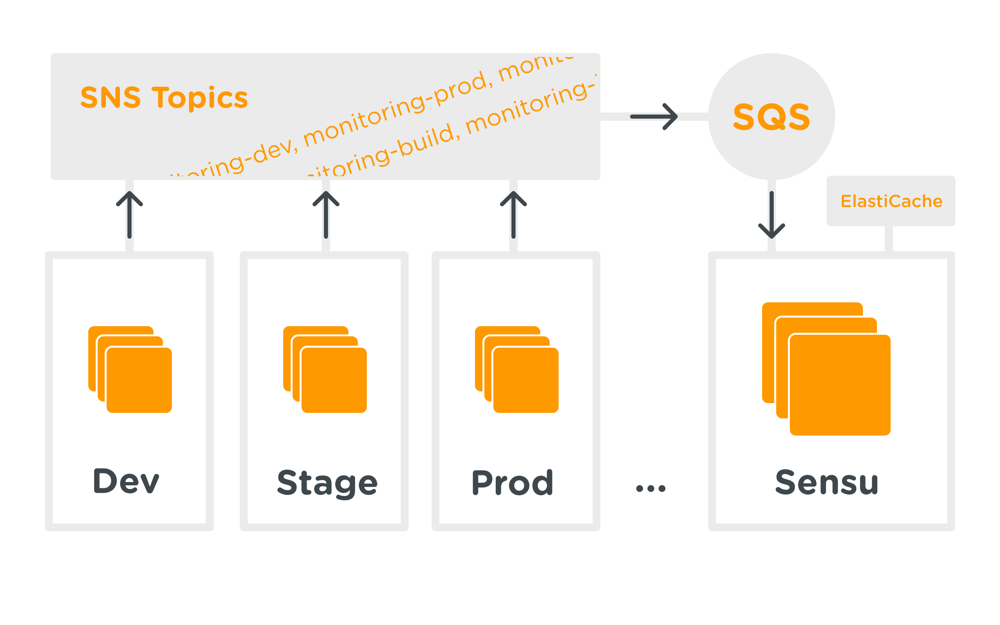

# sensu-transport-snssqs-ng

`sensu-transport-snssqs-ng` is a Sensu transport that produces messages over Amazon SNS and consumes messages from Amazon SQS, providing simplified monitoring using Sensu.

Messages flow from hosts onto an Amazon SNS topic. It is up to the operator to ensure that messages from the SNS topic flow to one SQS queue for consumption by the Sensu server.

This project is forked from the [the Simple team's project](https://github.com/SimpleFinance/sensu-transport-snssqs) to add additional community-generated enhancements. It is intended to provide a superset of the upstream features.

### Architecture



Messages flow unidirectionally: from the monitored hosts to the Sensu server. In this diagram, an SNS topic is created for each monitoring environment. Hosts within these environments publish messages onto their environment's SNS topic. All of these SNS topics place messages onto a single SQS queue. This singular SQS queue is consumed by the Sensu cluster to act on messages.

### Caveats

- This transport is compatible with Sensu 0.23.0 and presumably, later versions.

- Subscription-based checks are not supported. Sensu subscriptions require the transport to be two-way: The Sensu server must be able to send a message through the transport to a specific host. SQS has no way of filtering messages in an SQS queue. Therefore, to use this transport, you can only use `standalone` checks.

- This transport assumes that SNS is publishing to your SQS queue in "Raw" mode.

- This transport assumes that Sensu's process environment is properly configured to use the aws-sdk gem.

## Installation

To use this `snssqs` transport, this gem must be in your Sensu installation's ruby include path.

If you're installing Sensu via Chef, you can use the `sensu_gem` resource to ensure the gem is in Sensu's ruby include path:

```
sensu_gem 'sensu-transport-snssqs-ng' do
  action :install
end
```

Otherwise, if you're running Sensu via bundler, add this line to your Sensu installation's Gemfile:

```
gem 'sensu-transport-snssqs-ng'
```

That should place this gem into the include path.

## Configuration

First, we need to enable the `snssqs` transport. To do so, ensure that the following `transport` clause is in your configuration:

```json
{
  "transport": {
    "name": "snssqs",
    "reconnect_on_error": true,
   }
}
```
Now that the SNSSQS transport has been enabled, configure it using an `snssqs` clause:

```json
{
  "snssqs": {
    "max_number_of_messages": 10,
    "wait_time_seconds": 2,
    "region": "{{ AWS_REGION }}",
    "consuming_sqs_queue_url": "{{ SENSU_QUEUE_URL }}",
    "publishing_sns_topic_arn": "{{ SENSU_SNS_ARN }}"
    },
}
```

The following table lists possible settings and their descriptions. The values should be JSON strings unless specified otherwise.

| Setting                  | Description                                                                                                                                                                                                                                                                                                                           |
|--------------------------|---------------------------------------------------------------------------------------------------------------------------------------------------------------------------------------------------------------------------------------------------------------------------------------------------------------------------------------|
| max_number_of_messages   | The maximum number of messages to consume when consuming from SQS. This option is piped directly to the SQS client `receive_message` method. Setting this to the maximum possible value is the best way to improve performance. (JSON Number)                                                                                             |
| wait_time_seconds        | The number of seconds to wait while polling for messages from SQS. Keeping this value too high will cause Sensu's EventMachine reactor to block while waiting for messages for possibly too long. As a result, this value should typically be low. This option is used directly in the SQS client `receive_message` method. (JSON Number) |
| region                   | The region to specify when initializing the AWS SNS and SQS clients.                                                                                                                                                                                                                                                                  |
| consuming_sqs_queue_url  | The SQS Queue URL for which you want Sensu to consume from.                                                                                                                                                                                                                                                                           |
| publishing_sns_topic_arn | The SNS Topic ARN for which you want Sensu to publish messages to.                                                                                                                                                                                                                                                                    |
| statsd_addr              | Address to send statsd metrics to. If not set, the transport will not emit metrics to statsd.                                                                                                                                                                                                                                         |
| statsd_namespace         | Prefix to prepend to all statsd metrics. Should not end with a period.                                                                                                                                                                                                                                                                |
| statsd_sample_rate       | Set the sample rate for all statsd operations. This should be a string with a value between 0 and 1.0.                                                                                                                                                                                                                                |
## License

`sensu-transport-snssqs-ng` is released under the Apache 2.0 License, full copy of which is inside of the `LICENSE` file.
